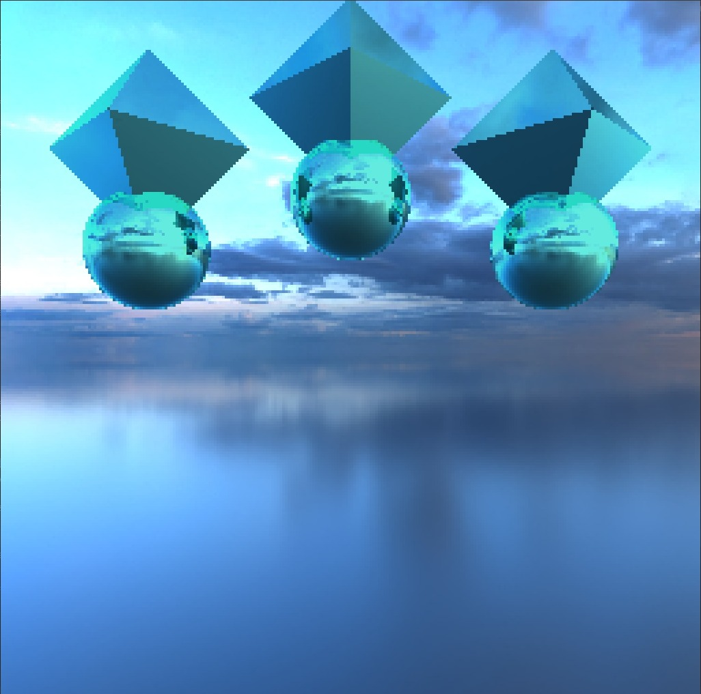
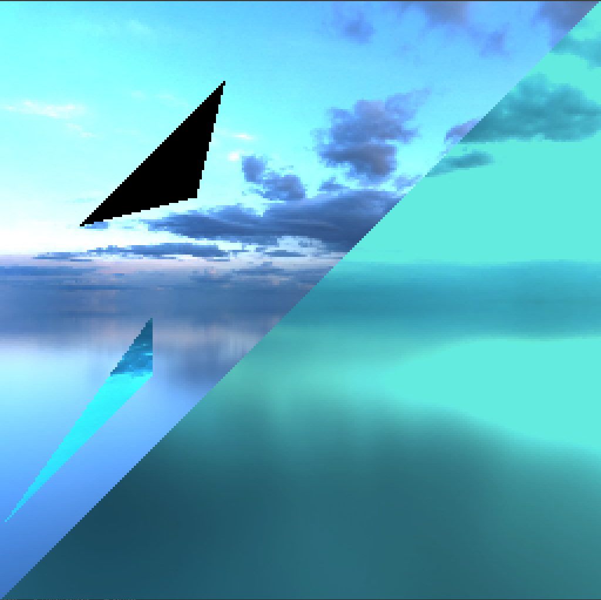
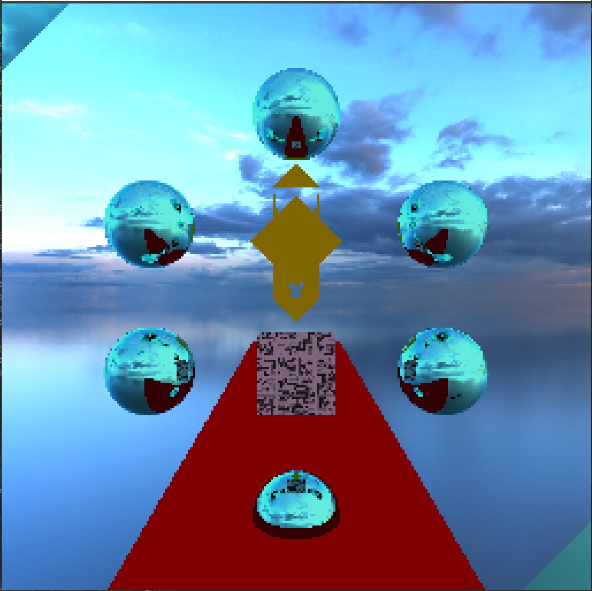
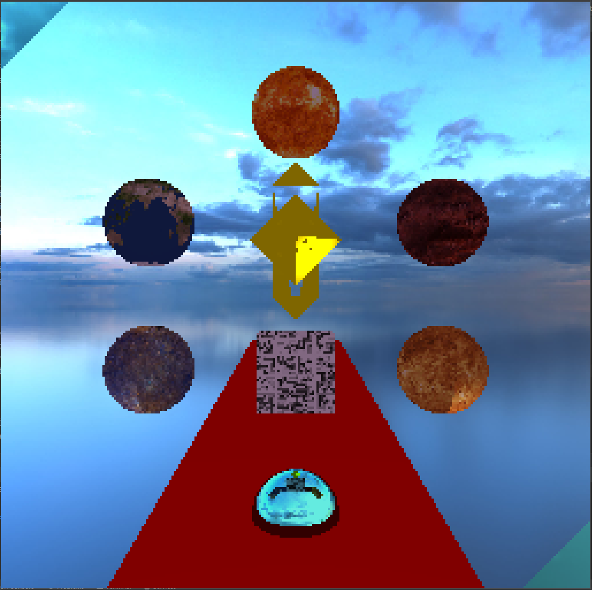

# LPROYECTO 2 RAYTRACER

## Instrucciones 

El objetivo de éste proyecto es demostrar los conocimientos adquiridos durante la segunda parte del curso.
 
Los alumnos deben entregar un Ray Tracer simple que trate de recrear una escena/imagen escogida por el alumno por medio de figuras simples.
 
La nota máxima es de 100 puntos. Se entregarán los siguientes puntos por cada uno de los objetivos que se cumplan. Pueden escoger los objetivos que quieran. No hay puntos extra.
 
La lista de requerimientos usados en el proyecto fue de:
 
 
-> 15 figuras (6 esferas, 6 triangulos, 1 plano, 1 cubo, 1 octaedro)
 
 
-> 10 materiales (6 con textura, 1 espejo, 1 transparente y demas opacos)
 
 
-> Enviroment map de paisaje celestial
 
 
-> Utilización de 2 figuras distintas no vistas en clase (triángulo y octaedro)
 
 
-> Utilización de 3 tipos de luces (Directional, Ambient, Point)
 

## Figuras no vistas en clase 

### Octaedro

En esta imagen se puede apreciar esta figura geométrica realizada con 8 triángulos unidos para formar la misma, el cotaedro se encuentra encima de las esferas
 

### Triangulos

En esta imagen se puede apreciar la figura geométrica de triangulos, los cuales se presentan en diferentes materiales y tamaños para su distinción. El triángulo negro es el opaco, el triangulo que está en la parte inferior izquiera es el transparente y el triángulo más grande es el reflectivo

## Output obtenido

### Output sin texturas 

En esta imagen se puede apreciar la escena sin luces ni texturas, con excepción del cubo al medio de la escena. Se puede oservar que son:
 
 
6 esferas (reflectivas)
 
1 plano que hace rol de alfombra
 
1 cubo que hace de stand 
 
4 triangulos y octaedro que conforman la escultura (intento de espada :( )
 
2 triangulos en las esquinas (transparentes) 
 

### Output Final 
Este es el otuput final, en donde se le aplican las texturas de planetas a las esferas y ademas se agregan la luz direccional y la luz ambiental
 

